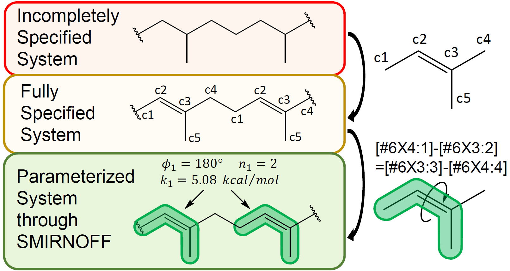

Polymer-Oriented LibrarY of Monomer Expression Rules and In-silico Synthesis Tools
==============================
[//]: # (Badges)
[](https://github.com/timbernat/polymerist/actions?query=workflow%3ACI)
[](https://codecov.io/gh/timbernat/polymerist/branch/main)

A unified set of tools for setting up molecular dynamics simulations of general organic polymer systems. Based upon concepts introduced in ["Parameterization of General Organic Polymers within the Open Force Field Framework" (Davel, Connor M., Bernat, Timotej, Wagner, Jeffrey R., and Shirts, Michael R.)](https://pubs.acs.org/doi/10.1021/acs.jcim.3c01691)



## Features
Includes functionality for:
* Generating monomer residue templates
* Performing automated *in silico* polymerization reactions
* Building linear homopolymers and copolymers (both topologies and coordinates)
* Force-field parameterization within the [OpenFF](https://openforcefield.org/about/organization/) framework
* Interfaces to semi-empirical and graph neural network-based atomic partial charge assignment
* Much more!
  
## Examples
Examples of how to import and invoke the core features of `polymerist` can be found in the accompanying [polymerist_examples repository](https://github.com/timbernat/polymerist_examples). Homepage and build files for `polymerist` are hosted on [PyPI](https://pypi.org/project/polymerist/).

## Requirements
### OS
`polymerist` is compatible with Linux (recommended) and Mac machines capable of installing Python 3.11. Due to [lack of support from AmberTools](https://ambermd.org/InstWindows.php), direct installation on Windows machines is not supported; **however**, this can easily be circumvented by using the [Windows Subsystem for Linux (WSL2)](https://learn.microsoft.com/en-us/windows/wsl/install)

### Python package manager
Before proceeding with installation, ensure you have some iteration of a Python package and environment management system installed on your machine. If you don't already have one installed, it's recommended you install either of:
* `mamba` through [Miniforge](https://mamba.readthedocs.io/en/latest/installation/mamba-installation.html)
* `conda` either as the lightweight [Miniconda](https://docs.anaconda.com/free/miniconda/miniconda-install/) or the significantly bulkier [Anaconda](https://www.anaconda.com/download). 
  
**`mamba` is very rapid and is the recommended package manager for this install; if you opt to use `conda` over `mamba`, be prepared for a markedly slower and more tedious install process!** Users with a pre-existing conda installation can [still install mamba](https://anaconda.org/conda-forge/mamba), so there's really no reason not to use it.
  
Once you have a package manager installed, you may proceed with one of the provided [polymerist installation methods](#installation).

## Installation
### 1) Core libraries
A fully-featured install in a safe virtual environment (named "polymerist-env", here) can be obtained by running the following terminal commands:

#### Mamba install (basic)
```bash
mamba create -n polymerist-env python=3.11
mamba activate polymerist-env
pip install polymerist
mamba install -c conda-forge openff-toolkit mbuild openbabel
```

#### Mamba install (extended)
An extended install with [Jupyter Notebook](https://jupyter.org/) support, molecular visualization capability, and chemical data querying capability can be obtained very similarly:
```bash
mamba create -n polymerist-env python=3.11
mamba activate polymerist-env
pip install polymerist[interactive,chemdb]
mamba install -c conda-forge openff-toolkit mbuild openbabel
```

#### Conda install (not recommended)
Equivalent commands using `conda` (in case `mamba` has not been installed or the user is too stubborn to use it) are given below. These will perform the same installation, just much more slowly:
```bash
conda create -n polymerist-env python=3.11
conda activate polymerist-env
pip install polymerist[interactive,chemdb]
conda install -c conda-forge openff-toolkit mbuild openbabel
```

In either case, the final [openff-toolkit](https://github.com/openforcefield/openff-toolkit) install step will take **_at least_** a few minutes, and will make the terminal output quite busy; remain calm, that's normal! 

#### 1.1) Testing installation
To see if the installation was successful, one can run the following short set of commands which should yield the outputs shown:
```python
mamba activate polymerist-env; python
>>> import polymerist as ps
>>> print(ps.pascal(5))
    1    
   1 1   
  1 2 1  
 1 3 3 1 
1 4 6 4 1
```

### 2) Parameterization toolkits
Assigning atomic partial charges using some flavor of [AM1-BCC](https://docs.eyesopen.com/toolkits/python/quacpactk/molchargetheory.html#am1bcc-charges) with `polymerist` also requires installation of some supplementary toolkits.

One can mix-and-match installing any combination of the toolkits below to taste or (if impatient or indifferent) opt for a "shotgun" approach and install all 3 with the following commands:
```bash
mamba activate polymerist-env
mamba install -c openeye openeye-toolkits
mamba install -c conda-forge espaloma_charge openff-nagl
```

#### 2.1) [OpenEye toolkits (closed-source)](https://docs.eyesopen.com/toolkits/python/intro.html)
These toolkits are required to perform explicit [AM1-BCC charge assignment with conformer selection](https://docs.eyesopen.com/toolkits/python/quacpactk/molchargetheory.html#elf-conformer-selection) and enhance OpenFF conformer generation, but **`polymerist` does not *require* OpenEye to work**. If you already have (or can obtain) an OpenEye [license](https://docs.eyesopen.com/toolkits/python/quickstart-python/license.html) and wish to install the OpenEye toolkits individually, follow the [install instructions](https://docs.eyesopen.com/toolkits/python/quickstart-python/linuxosx_anaconda.html#:~:text=Install%20the%20OpenEye%20Python%20Toolkits%20into%20the%20new%20environment%3A) provided by OpenEye

#### 2.2) [Espaloma-charge](https://github.com/choderalab/espaloma-charge)
This is a standalone graph neural network (GNN) model [Wang et. al.](https://pubs.acs.org/doi/10.1021/acs.jpca.4c01287) which can assign atomic partial charges trained on AM1-BCC data extremely rapidly. To install individually, follow the [install instructions](https://github.com/choderalab/espaloma-charge?tab=readme-ov-file#installation) provided by its developers.

#### 2.3) [OpenFF NAGL](https://docs.openforcefield.org/projects/nagl/en/latest/index.html)
This is an OpenFF-specific GNN based on similar architecture to Espaloma with a generally better validated partial charge model. To install individually, follow the [install instructions](https://docs.openforcefield.org/projects/nagl/en/latest/installation.html#:~:text=If%20you%20prefer%2C%20NAGL%20may%20be%20installed%20into%20the%20current%20environment%3A) provided by the OpenFF NAGL documentation.


### Installing from source (optional)
Polymerist can also be installed directly from the source code in this repository. To install, execute the following set of terminal commands in whichever directory you'd like the installation to live on your local machine:

#### Mamba install (source)
```bash
git clone https://github.com/timbernat/polymerist
cd polymerist
mamba env create -n polymerist-env -f devtools/conda-envs/release-build.yml
mamba activate polymerist-env
pip install .
```

#### Conda install (source, not recommended)
```bash
git clone https://github.com/timbernat/polymerist
cd polymerist
conda env create -n polymerist-env -f devtools/conda-envs/release-build.yml
conda activate polymerist-env
pip install .
```
Once the source install is complete, you no longer need the clone of the polymerist repo and can remove it from your file system.

### Developer installation (for advanced users only)
Those developing for `polymerist` may like to have an editable local installation, in which they can make changes to the source code and test behavior changes in real-time. In this case, one requires an "editable build" which mirrors the source files that live in the site_packages directory of the created environment. This type of installation proceeds as follows:
```bash
git clone https://github.com/timbernat/polymerist
cd polymerist
mamba env create -n polymerist-dev -f devtools/conda-envs/dev-build.yml
mamba activate polymerist-dev
pip install -e . --config-settings editable_mode=strict
```
The `--config-settings editable_mode` flag in the final line allows this installation to "play nicely" with PyLance, making auto-completion and navigation to source code much easier for VSCode users. **It is optional, and can be removed if this compatibility is not desired**

## Documentation
Documentation for `polymerist` (work in progress) can be found on [ReadTheDocs](https://polymerist.readthedocs.io/en/latest/index.html)

### Copyright

Copyright (c) 2024, Timotej Bernat (timotej.bernat@colorado.edu)

### Acknowledgements
 
Project based on the 
[Computational Molecular Science Python Cookiecutter](https://github.com/molssi/cookiecutter-cms) version 1.1.
