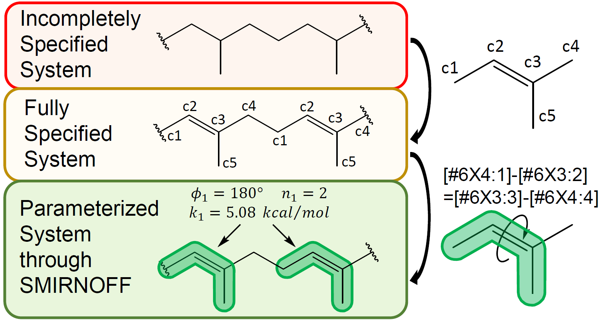

.. polymerist documentation master file, created by
   sphinx-quickstart on Thu Mar 15 13:55:56 2018.
   You can adapt this file completely to your liking, but it should at least
   contain the root `toctree` directive.

Welcome to polymerist's documentation!
==============================================================================================================
This is the documentation for the Polymer-Oriented LibrarY of Monomer Expression Rules and In-silico Synthesis Tools, or just "polymerist" for short.

Polymerist is a unified set of tools for setting up molecular dynamics simulations of general organic polymer systems.
It was originally developed around concepts introduced in our manuscript 
[`"Parameterization of General Organic Polymers within the Open Force Field Framework" <https://pubs.acs.org/doi/10.1021/acs.jcim.3c01691>`_
, Davel, Connor M., Bernat, Timotej, Wagner, Jeffrey R., and Shirts, Michael R.],
but has over time evolved into a more fully-featured library.

Features
========
* Generating chemical information-rich monomer residue templates
* Enumeration of all possible repeat units of a polymer ensemble given initial monomers and a target polymerization mechanism
* Building of linear homopolymers and copolymers (both topologies and coordinates)
* Solvating polymer systems
* Packing of many polymer chains into melt-like boxes
* Force-field parameterization within the OpenFF framework
* Interfaces to semi-empirical and graph neural network-based atomic partial charge assignment
* Reproducible simulation specification API
* Interfaces to OpenMM for running serial simulations with different thermodynamic parameters
* Much more!

.. toctree::
   :maxdepth: 2
   :caption: Getting started:

   prereqs
   installation/index
   examples
   theory

Indices and tables
==================

* :ref:`genindex`
* :ref:`modindex`
* :ref:`search`
