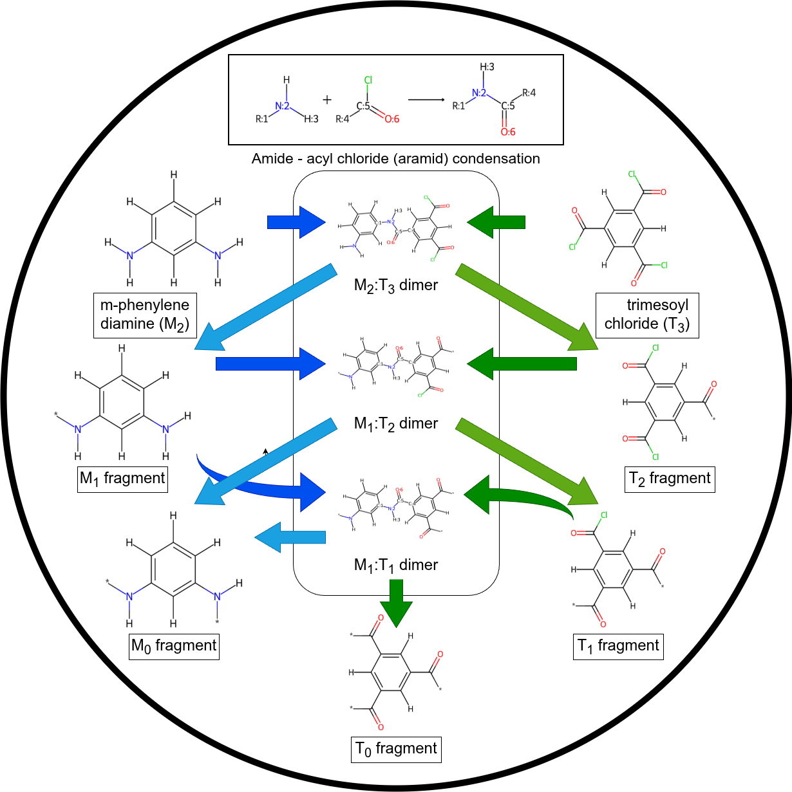
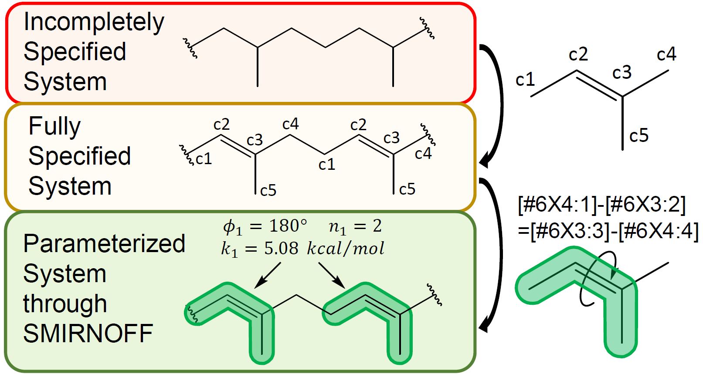

Publications
============
Polymerist has been developed around concepts introduced in our manuscripts, viz.: 

* `"Robust, transferrable, and automatable techniques for systematic in silico polymerization" <https://doi.org/10.26434/chemrxiv.15002977/v1>`_ (Timotej Bernat, Jeffrey N. Law, Daria Lazarenko, Brandon C. Knott, and Michael R. Shirts, 2026)

    
* `"Parameterization of general organic polymers within the Open Force Field Framework" <https://pubs.acs.org/doi/10.1021/acs.jcim.3c01691>`_ (Connor M. Davel, Timotej Bernat, Jeffrey R. Wagner, and Michael R. Shirts, 2024)

